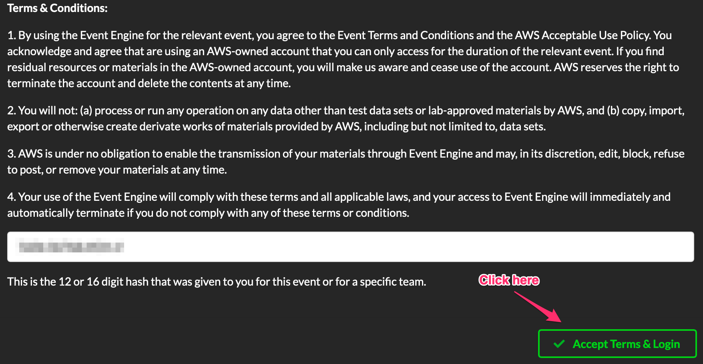
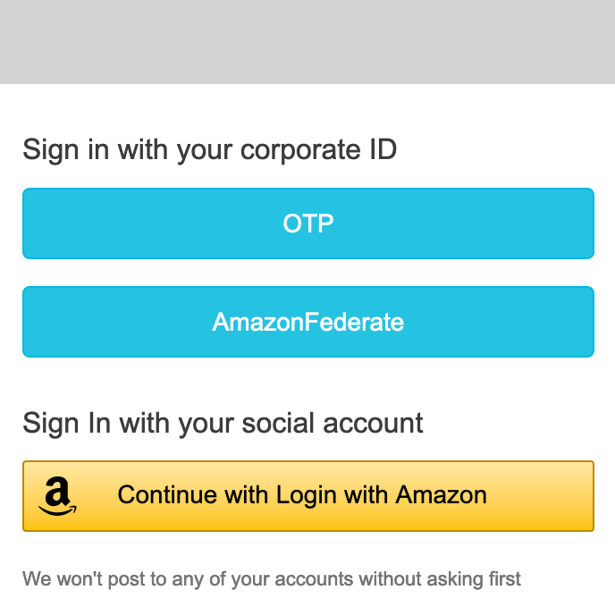
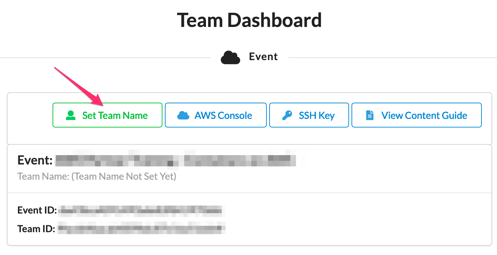
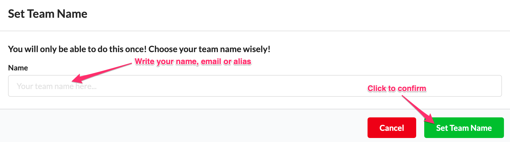
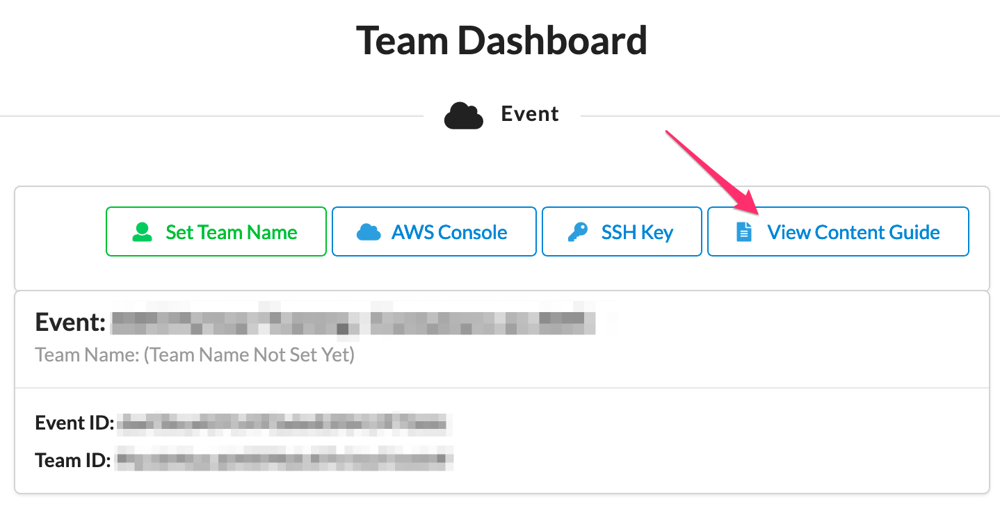
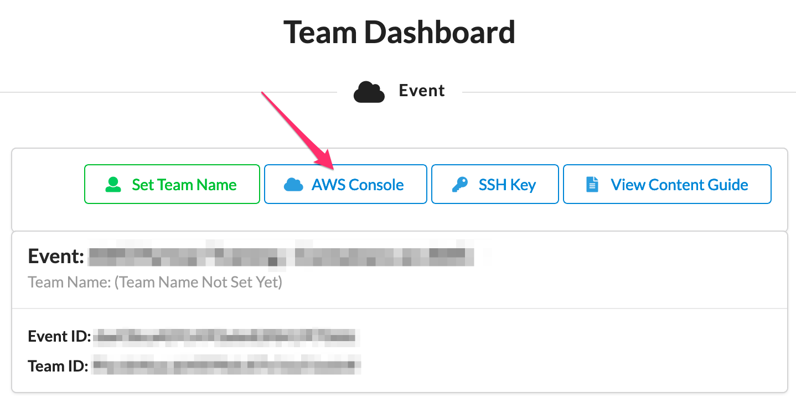
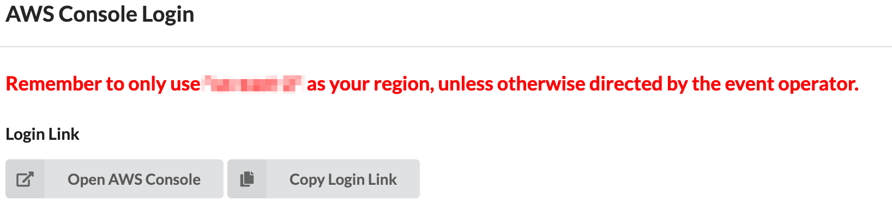
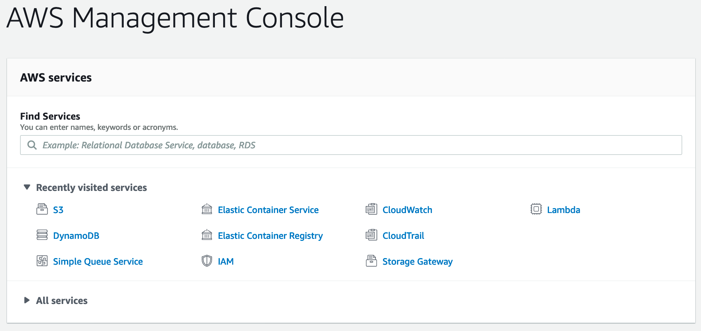

+++ 
title = "AWS Workshop - Event Engine" 
chapter = true 
weight = 1 
+++

## Lab access instructions

1. To access to lab environment you need to enter the following URL <a href="https://dashboard.eventengine.run/login" target="_blank">Event Engine Dashboard</a>

1. Enter the **event hash** provided by the instructor and click on **Accept Terms & Login**

	

1. You will see this login information window, instructor will give you specific instructions on which option to select to access your lab environment

	

1. Once logged into the lab environment, in order to identify the AWS account you will be using, change the Team's name. Please click on **Set Team Name**:

	

1. Enter your name, email or an alias:

	

1. To access the lab instructions click on **View Content Guide**. A new browser tab will be launched.

    

1. To access the console click on **AWS Console**:

	

1. ... and click on **Open AWS Console**:

	

1. There you go, enjoy!

	
